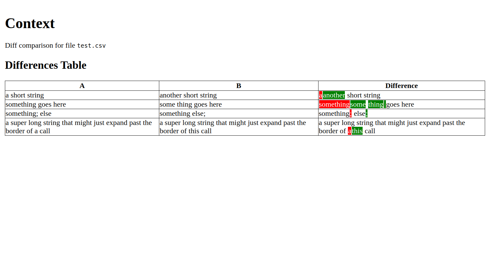

# Line Diff

This is a simplistic way to diff text using custom tokenization and lookahead criteria.

This can be used as a library for more complicated use cases. Or...

## diffhtml

This tool allows producing an HTML rendering of all the differences in a CSV file.

This output was created using `diffhtml --csv=test.csv -a 0 -b 1 --delim=' ;'`.

